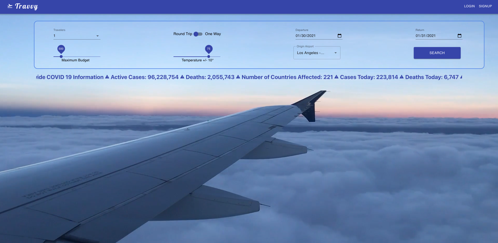
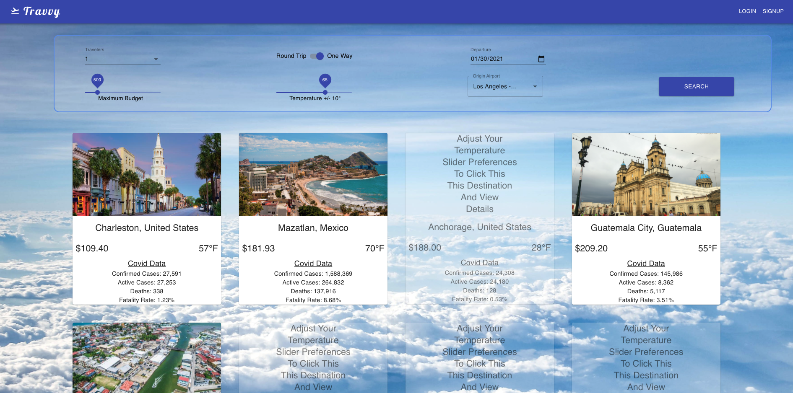
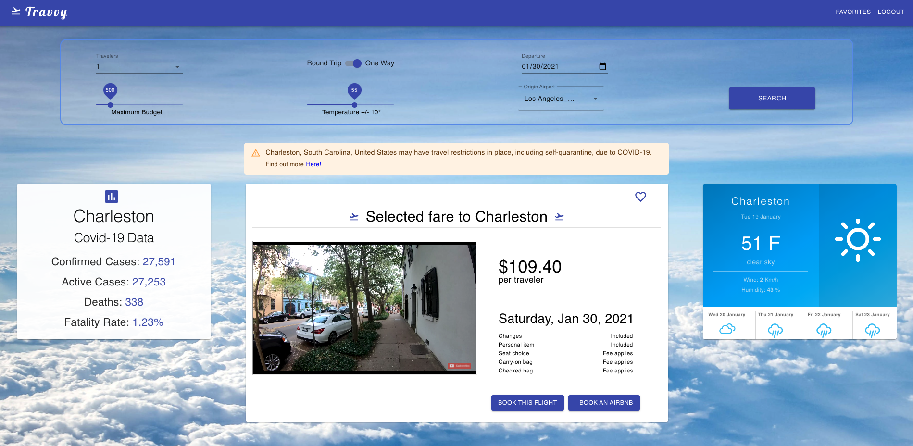
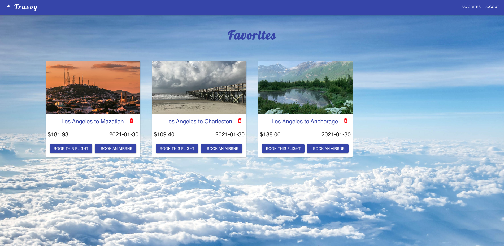

# Travvy

 

  

  <h3 align="center">Travvy</h3>

  

    A place for travelers to get destination recommendations based on their preferences.
     
    <a href="https://www.youtube.com/watch?v=7QZGHH1zijQ&feature=youtu.be" target="_blank">
      Video Demo
    </a>

## About The Project
Authenticated website for users to search for destinations/flights based on specific criteria to include budget, temperature, departure/return date, number of travelers, and origin location. 

### Built With

* [React](https://reactjs.org/) - Used for front end with Javascript
* [Django](https://www.djangoproject.com/) - Used for back end with Python
* [PostgreSQL](https://www.postgresql.org/) - Used for database and connected to Django
* [Material UI](https://www.material-ui.com/) - Used for styling
* [Amadeus API](https://www.developers.amadeus.com/) - Used for flight search 
* [Pexels API](https://www.pexels.com/api/) - Used for location photo generation 
* [Open Disease Data API](https://corona.lmao.ninja/v2/all) - Used for retreiving covid-19 information 
* [React Open Weather](https://www.npmjs.com/package/react-open-weather/) - Used for retreiving weather data

## Features

Search for flights based on your preferences and receive a list of destinations based on your criteria. 

Click on a destination to get details about that specific location to include a video tour, COVID data/travel restrictions, weather, price, and the ability to buy the flight/place to stay for your destination. 

You also have the ability to save a trip to your favorites for later use. 

## Contact

LinkedIn - https://www.linkedin.com/in/rodriguez-michael/

Email - contact@michaelrodriguez.dev

Personal Site - https://michaelrodriguez.dev/